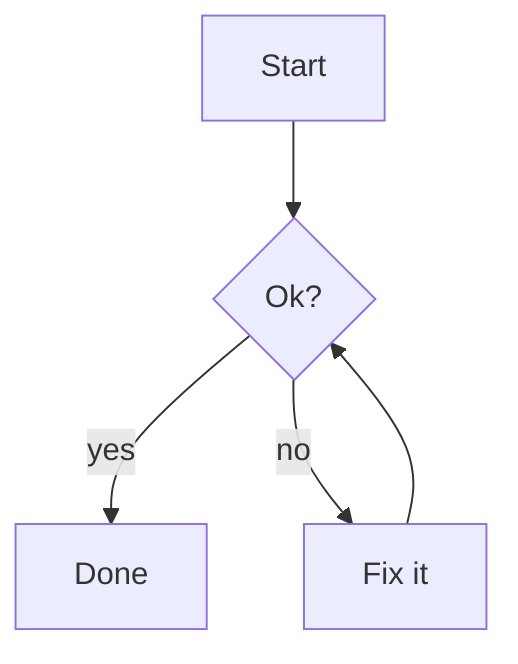
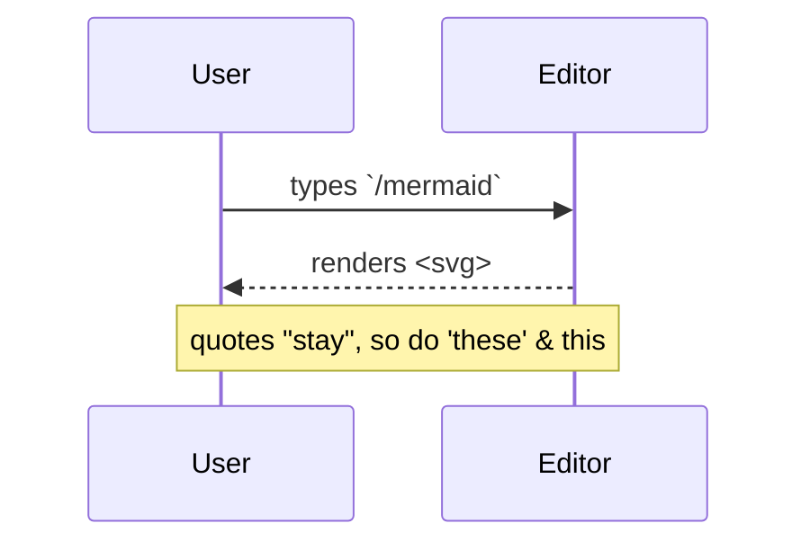
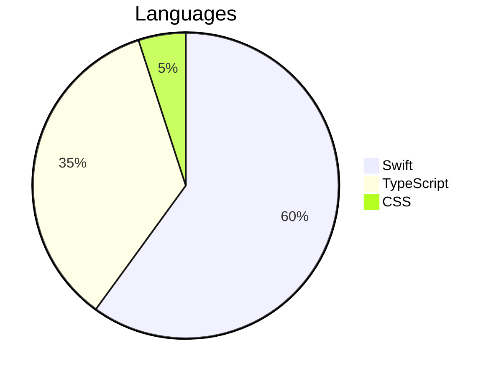

```mermaid
graph TD
  A[Start] --> B{Ok?}
  B -- yes --> C[Done]
  B -- no --> D[Fix it]
  D --> B
```

Text between diagrams.

```mermaid
sequenceDiagram
    participant U as User
    participant E as Editor
    U->>E: types `/mermaid`
    E-->>U: renders <svg>
    Note over U,E: quotes "stay", so do 'these' & this
```

```mermaid
pie title Languages
    "Swift" : 60
    "TypeScript" : 35
    "CSS" : 5
```
